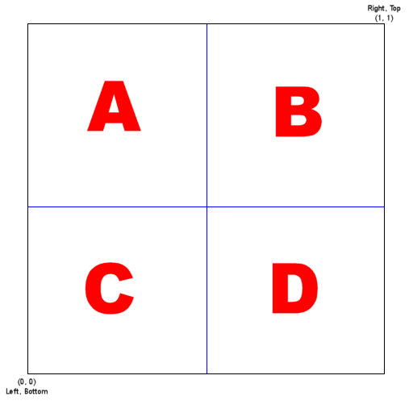

# Installation for VRChat using VCC

1. **[Click Here To Install](https://zebranorth.github.io/TheSpiralizer/)**
2. Click "**Add to VCC**".  This will launch VCC and prompt you to add the repository.
3. Click "**Manage Project**" in VCC.
4. Click the "**(+)**" button next to "The Spiralizer".

# Usage

After installing, create a new material and select `Zebra North\The Spiralizer` as the shader.

Use the Inspector to edit the material to look how you desire.

To update to the latest version, simply press the update button in VCC under "Manage Project".

## Optimization

The checkboxes enable features at compile time, so turn off any features you are not using for best performance.  If you wish to enable or disable a feature at runtime then make sure the box is checked and use the corresponding opacity slider to control the effect.

## Options

### Blend Mode

- `Opaque`: No transparency. Best framerate. **Default.**
- `Transparent`: Alpha blending (fading in and out).
- `Additive`: Brighten the image.

### Depth Test

- `Normal`: Render as a normal object.  **Default.**
- `Always On Top`: Render on top of objects that are in front of it.

### Enable Texture

Enable overlaying an image on top of the spiral.

### Image Texture

The image to overlay.

#### Image Scale

A multiplier for the size of the image.

#### Image Crop: Left, Right, Bottom, Top

Crop the image down to the area between (Left, Bottom) and (Right, Top).

You can use these parameters in conjunction with an animation to display multiple images in sequence.

For example, you might divide your texture into four areas and address them as follows:

- `A` is at Left = 0.0, Right = 0.5, Bottom = 0.5, Top = 1.0.
- `B` is at Left = 0.5, Right = 1.0, Bottom = 0.5, Top = 1.0.
- `C` is at Left = 0.0, Right = 0.5, Bottom = 0.0, Top = 0.5.
- `D` is at Left = 0.5, Right = 1.0, Bottom = 0.0, Top = 0.5.

You can divide your image into as many pieces as you like.

If you wish to use only a single image then leave these fields at their default values of Left = 0, Right = 1, Bottom = 0, Top = 1.

### Image Opacity

The overall opacity of the texture on top of the spiral.

### Arms

The number of arms the spiral has.  Must be an integer.

### Tightness

How tightly coiled the spiral is.

### Lensing

A number < 1 will make the spiral get tighter towards the middle.  A value > 1 will make the spiral get tighter towards the outside.

### Width

The thickness of the foreground colour.

### Rotation Speed

How quickly the spiral spins.

### Background Colour

The colour of the background.

### Foreground Colour

The colour of the spiral arms.

### Centre and Scale

You can use these options to adjust the position and aspect ratio of the spiral if your object is not a simple square UV mapped in the range (0, 0) to (1, 1).

`X` and `Y` control the centre of the spiral relative to the UV position (0.5, 0.5).

`Z` and `W` control the horizontal and vertical scale of the spiral.

### Spiral Opacity

The overall opacity of the spiral.

Only available if the "Blend Mode" is not "Opaque".

### Enable Noise

Enable a white noise static overlay.

### Noise Scale

How big the blocks of white noise should be.

### Noise Opacity

The opacity of the white noise overlay.

### Enable Vignette

Enable a circular fade around the spiral.

### Vignette Opacity

The opacity of the vignette overlay.

### Vignette Colour

The colour to which the spiral fades.

This is only available if "Blend Mode" is "Opaque".  In other blend modes the spiral fades to transparent.

# Licence

This code is open source, feel free to modify it to suit your needs, I only ask that you do not remove my name from it.

If you have suggestions or improvements then send me a message or open a pull request.

Credit is appreciated but not required.

# Enjoy

I hope you enjoy this project!

You can support me through https://github.com/ZebraNorth
